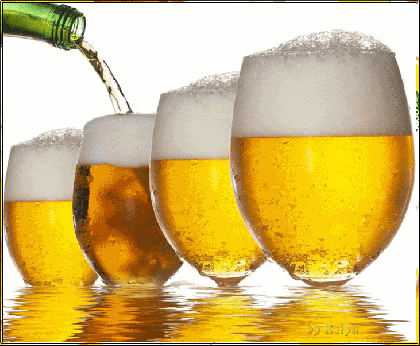

<!-- PredictivePandas -->
# PredictivePandas

<!---Project Logo -->
<br />
<p align="center">

  <a href="https://github.com/mactzu/PredictivePandas">
    
  </a>

  <h3 align="center">The Beer Project</h3>
  <p align="center">
    Demystifying Machine Learning
    <br />
</p>
</p>


<!-- TABLE OF CONTENTS -->
## Table of Contents

* [About the Project](#about-the-project)
* [About the Model](#about-the-model)
  * [Built With](#built-with)
* [Project Tree](#project-tree)
* [Usage Example](#usage)
* [Getting Started](#getting-started)
  * [Heroku](#heroku)
  * [Local](#local)
* [Contributors](#contributors)
* [Acknowledgements](#acknowledgements)


<!-- USAGE EXAMPLE -->
## Usage


<!-- ABOUT THE PROJECT -->
## About The Project
When starting out on this project we were told to 'pick something we were passionate about'.  Well, that was easy - food and alcohol ... some of the greatest joys in life, right?  We knew we wanted to create a recommendation engine and as we started looking around we found plenty.  Restaurant recommenders, cuisine recommenders, locality based recommenders and of course the wine recommenders.  But what about beer?  Not too many out there.  Whilst worldwide beer consumption is on the decline, the interest in craft beer is surging.  Driven by passionate home brewers and craft beer makers, together with increasingly more sophisticated beer drinkers, the choices are growing and exponentially.  So how do you find that illusive 'best' beer when you don't even know it's out there?  That's where our model comes in.

<!-- ABOUT THE MODEL -->
## About The Model
The beer recommender model is built using review scores, review words, and beer characteristics sourced from [dataworld](https://data.world/socialmediadata/beeradvocate#) and [beer advocate](https://www.beeradvocate.com/). A K-means clustering model was used to assign unique beers into clusters, and a collaborative filtering approach was used to build a recommender that will recommend beers based on users' desired beer characteristics.

<!-- PROJECT TREE -->
## Project Tree

* [config](/config) 
* [data](/data) - cleaned data and flat file database
* [notebooks](/notebooks) - for data cleaning and model testing - not necessary for running the app
   * [00_DataExtract-Clean](./notebooks/00_DataExtract-Clean.ipynb)
   * [01_DataPrep-ML](./notebooks/01_DataPrep-ML.ipynb)
   * [02_K-Means](./notebooks/02_K-Means.ipynb)
* [source](/source) - original data sources
* [static](/static)
   * [css](./static/css)
   * [images](./static/images)
   * [js](./static/js)
 * [templates](/templates)
 * [README.md](./README.md)
 * [app.py](./app.py)
 * [requirements.txt](./requirements.txt)


### Built With
* [Python](https://www.python.org/about/)
  * [Flask](https://flask-doc.readthedocs.io/en/latest/)
  * [Joblib](https://joblib.readthedocs.io/en/latest/)
  * [pandas](https://pandas.pydata.org/pandas-docs/stable/getting_started/index.html)
     * [matplotlib](https://matplotlib.org/)
     * [scikit-learn 0.23.2](https://scikit-learn.org/stable/user_guide.html)
     * [NumPy](https://numpy.org/)
     * [tagcomplete](https://github.com/razzbee/tagcomplete)
     * [seaborn](http://seaborn.pydata.org/index.html)
     * [Beautiful Soup](https://www.crummy.com/software/BeautifulSoup/bs4/doc/)
* [HTML](https://developer.mozilla.org/en-US/docs/Web/HTML)
* [CSS](https://developer.mozilla.org/en-US/docs/Web/CSS#:~:text=Cascading%20Style%20Sheets%20%28CSS%29%20is%20a%20stylesheet%20language,on%20paper%2C%20in%20speech%2C%20or%20on%20other%20media.)
* [Javascript](https://developer.mozilla.org/en-US/docs/Web/javascript)
  * [d3.js](https://d3js.org/)
  * [Leaflet](https://leafletjs.com/)


<!-- GETTING STARTED -->
## Getting Started
If you would like to run a local version with the full dataset, skip to [Local](#local). If you wish to run a scaled down version on your own Heroku app, follow the following [Heroku](#heroku) steps.

### Heroku
**To get up and running on heroku, follow these steps.**
1. Fork our directory on github.
2. Sign up for an [Heroku](https://www.heroku.com/) account.
3. Sign up for [mapbox](https://www.mapbox.com/), and replace your api key with ours on the _/static/js/config.js_ file. Remember to restrict your mapbox api key to your app url, so you don't get hit with nasty charges!!!
4. Connect your github page to a new Heroku app, and click **'Deploy'**.
5. And now you are all set. Have fun with your new app!

### Local
**To get a local copy up and running follow these steps.**
1. Clone our directory down to your local machine.
```sh
git clone https://github.com/mactzu/PredictivePandas.git
```
2. Ensure you have the following [Python](https://www.python.org/downloads/) version 3.6 or later installed.
3. Ensure you have the libraries listed in [requirements.txt](requirements.txt) installed. An easy way to do so is to type
  ```sh
  $ pip install -r requirements.txt
  ```
4. Get a free API Key at _mapbox_ [https://www.mapbox.com/](https://www.mapbox.com/), and replace your api key with ours on the _/static/js/config.js_ file.
5. Run app.py and you are all set. Open up the flask page and have fun!
```sh
$ python app.py
```

<!-- CONTRIBUTORS -->
## Contributors

* Yann Chye
* Pooja Mallard
* Eammon McCallum
* Kat Shamai
* Ruohong Yuan
* Michelle Hocking 

***

<!-- ACKNOWLEDGEMENTS -->
## Acknowledgements
Data sourced from:
* [https://data.world/socialmediadata/beeradvocate](https://data.world/socialmediadata/beeradvocate#)
* [https://www.beeradvocate.com](https://www.beeradvocate.com/)
* [Geocoding (latitude/longitude lookup)](https://developers.google.com/maps/documentation/geocoding/overview)

Additional resources:
* [Words to describe the beer you are tasting](https://appellationbeer.com/blog/words-to-describe-the-beer-you-are-tasting/)
* [Beer Flavor Descriptors](https://winning-homebrew.com/beer-flavor-descriptors.html)
* [Introduction to TWO approaches of Content-based Recommendation System](https://towardsdatascience.com/introduction-to-two-approaches-of-content-based-recommendation-system-fc797460c18c)
* [Content-Based Filtering model](https://github.com/youonf/recommendation_system/blob/master/content_based_filtering/content_based_recommender_approach1.ipynb)
* [Selecting the number of clusters with silhouette analysis on KMeans clustering - scikit-learn 0.23.2 documentation](https://scikit-learn.org/stable/auto_examples/cluster/plot_kmeans_silhouette_analysis.html)
* [A Guide To Rating Beer - News and Features - Ratebeer](https://www.ratebeer.com/Story.asp?StoryID=103)
* [How to Create Autocomplete on an Input Field](https://www.w3schools.com/howto/howto_js_autocomplete.asp)
* [Top 50 matplotlib Visualisations - The Master Plots (with full python code)](https://www.machinelearningplus.com/plots/top-50-matplotlib-visualizations-the-master-plots-python/)
* [Best-README-Template](https://github.com/HockingM/Best-README-Template/edit/master/README.md)
